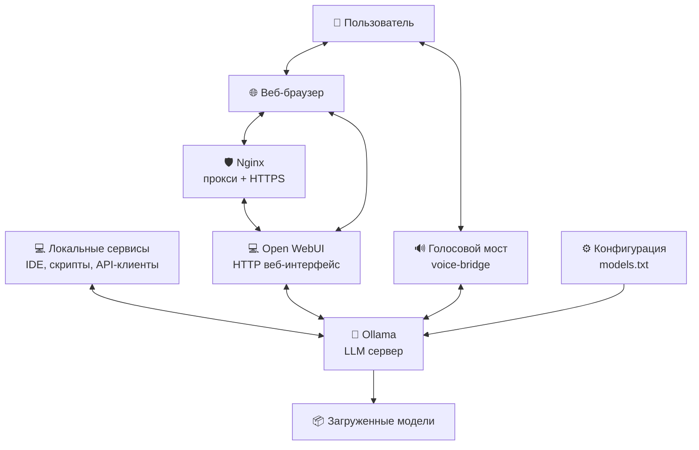

# AI Stack с Ollama и голосовым интерфейсом

Полнофункциональный стек искусственного интеллекта с локальными LLM моделями, веб-интерфейсом и голосовым взаимодействием.

## 🚀 Возможности

- **Локальные LLM модели** через Ollama
- **Веб-интерфейс** Open WebUI (аналог ChatGPT UI)
- **Голосовой интерфейс** для взаимодействия с ИИ
- **Автоматическая загрузка моделей** из конфигурационного файла
- **HTTPS поддержка** через Nginx с самоподписанными сертификатами

## 📐 Архитектура



## ⚡ Быстрый старт

### Предварительные требования

- **Docker** и **Docker Compose**
- **Минимум 8 ГБ ОЗУ** (рекомендуется 16+ ГБ)
- **20 ГБ свободного места** на диске для моделей
- **Доступ в интернет** для загрузки моделей
- **Микрофон и колонки** для голосового интерфейса

### Установка и запуск

1. **Клонируйте репозиторий**
   ```bash
   git clone https://github.com/NikitaShubin/SelfHostedAI.git
   cd SelfHostedAI
   ```

2. **Настройте модели** (опционально)
   Отредактируйте файл `models.txt`, раскомментировав или дописав нужные модели:
   ```bash
   nano models.txt
   ```

3. **Запустите стек**:
   ```bash
   ./run.sh
   ```

4. **Дождитесь загрузки моделей** (может занять время в зависимости от выбранных моделей и скорости интернета)

5. **Откройте в браузере**:
   - Веб-интерфейс: https://localhost
   - Прямой доступ к WebUI: http://localhost:8080
   - Ollama API: http://localhost:11434

## 🎯 Использование

### Веб-интерфейс (Open WebUI)

1. Откройте https://localhost в браузере
2. Примите самоподписанный сертификат (предупреждение безопасности)
3. Зарегистрируйте нового пользователя или войдите
4. Выберите модель из списка загруженных
5. Начните общение с ИИ

### Голосовой интерфейс

1. Запустите голосовой мост:
   ```bash
   docker compose exec voice-bridge python bridge.py
   ```
2. Нажимайте Enter для начала записи
3. Говорите в микрофон (до 5 секунд)
4. Слушайте ответ ИИ

### API Ollama

Прямой доступ к Ollama API доступен по адресу:
```bash
# Список моделей
curl http://localhost:11434/api/tags

# Генерация текста
curl http://localhost:11434/api/generate -d '{
  "model": "qwen2.5-coder:7b-instruct",
  "prompt": "Привет, как дела?",
  "stream": false
}'
```

<details>
<summary style="font-weight: 500; font-size: 24px">📁 Структура проекта</summary>

```
.
├── nginx/                # Nginx прокси с SSL
│   ├── Dockerfile        # Образ Nginx с генерацией сертификатов
│   ├── generate-ssl.sh   # Скрипт генерации SSL сертификатов
│   └── nginx.conf        # Конфигурация Nginx
├── ollama/               # Ollama сервер
│   ├── Dockerfile        # Образ Ollama с утилитами
│   └── init-models.sh    # Скрипт загрузки моделей
├── voice_bridge/         # Голосовой интерфейс
│   ├── Dockerfile        # Образ голосового моста
│   ├── bridge.py         # Основной скрипт
│   └── requirements.txt  # Python зависимости
├── docker-compose.yaml   # Конфигурация Docker Compose
├── models.txt            # Список моделей для загрузки
├── monitor.sh            # Мониторинг сервисов
├── restart.sh            # Перезапуск стека
├── run.sh                # Основной скрипт запуска
└── stop.sh               # Остановка стека
```
</details>

<details>
<summary style="font-weight: 500; font-size: 24px">⚙️ Конфигурация и мониторинг</summary>

### Переменные окружения

В `docker-compose.yaml` можно настроить:

- `OLLAMA_KEEP_ALIVE`: Время хранения моделей в памяти
- `OLLAMA_HOST`: Адрес сервера Ollama
- `HF_HUB_OFFLINE`: Режим работы с HuggingFace

### Портs

- `80`: HTTP (редирект на HTTPS)
- `443`: HTTPS (веб-интерфейс)
- `8080`: Прямой доступ к Open WebUI
- `11434`: Ollama API

### Настройка моделей

Для внесения новых моделей в систему добавьте их названия в список `models.txt` и выполните перезапуск:
```bash
./restart.sh
```
Удаление или комментирование строк в списке не приведёт к удалению уже установленных модели из системы.

Размеры моделей:

- **7B модели**: ~4-5 ГБ, работают на CPU (медленно) или GPU
- **8B модели**: ~5-6 ГБ, хороший баланс качества/скорости
- **20B+ модели**: 10+ ГБ, требуют много памяти и GPU

### Мониторинг

```bash
# Статус всех сервисов
./monitor.sh

# Логи конкретного сервиса
docker compose logs ollama -f
docker compose logs voice-bridge -f
```
</details>

<details>
<summary style="font-weight: 500; font-size: 24px">🔒 Безопасность и продакшн</summary>

### Самоподписанные сертификаты

Стек использует самоподписанные SSL сертификаты для разработки. В браузере появится предупреждение - это нормально.

### Для продакшена:

1. Замените сертификаты в `./data/nginx/` на полученные от Let's Encrypt
2. Обновите `nginx.conf` для использования реальных доменов
3. Настройте брандмауэр для доступа только к необходимым портам

### Рекомендации по безопасности:

1. Не используйте в публичных сетях без настройки аутентификации
2. Ограничьте доступ к портам 11434 (Ollama API) и 8080 (WebUI)
3. Регулярно обновляйте образы Docker

</details>

<details>
<summary style="font-weight: 500; font-size: 24px">🙏 Благодарности</summary>

- [Ollama](https://ollama.ai) - За фреймворк для локальных LLM
- [Open WebUI](https://github.com/open-webui) - За веб-интерфейс
- [OpenAI Whisper](https://github.com/openai/whisper) - За распознавание речи
- [👤Стасу](https://github.com/stansf) - За первую рабочую версию проекта
- [DeepSeek](https://chat.deepseek.com) - За помощь в развитии

</details>

---

**Примечание**: Этот проект предназначен для локального использования и разработки. Для продакшн-использования требуется дополнительная настройка безопасности и производительности.

📄 Лицензия: [MIT](./LICENSE)