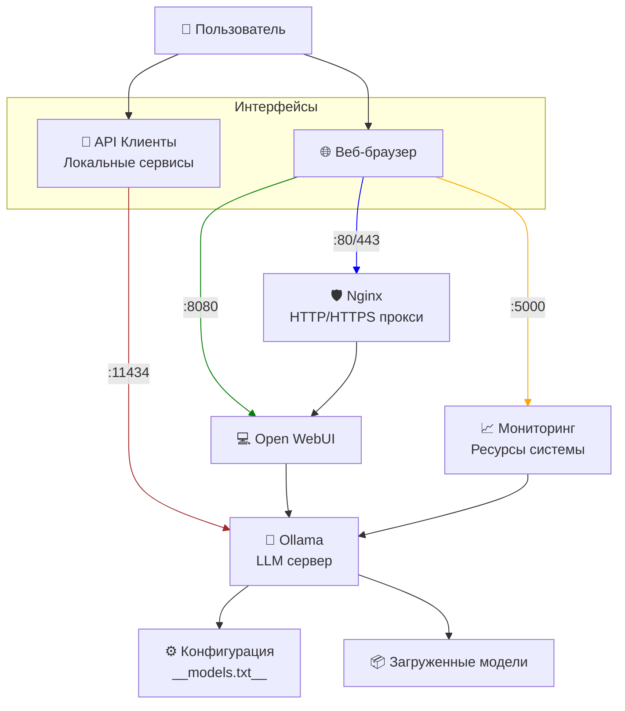

<!-- markdownlint-disable MD033 -->

# AI Stack с Ollama и веб-интерфейсом

Полнофункциональный стек искусственного интеллекта с локальными LLM моделями
и современным веб-интерфейсом.

## 🚀 Возможности

- **Локальные LLM модели** через Ollama
- **Веб-интерфейс** Open WebUI (аналог ChatGPT UI)
- **Голосовой ввод/вывод (STT/TTS)** средствами WebUI (доступно при HTTPS-подключении)
- **Встроенный мониторинг ресурсов** с веб-интерфейсом и графиками в реальном времени
- **Автоматическая загрузка моделей** из конфигурационного файла
- **HTTP/HTTPS поддержка** через Nginx (самоподписанные сертификаты для HTTPS)

## 📐 Архитектура


```mermaid
flowchart TD

    classDef invisibleLine stroke:none,stroke-width:0
    %% classDef invisible fill:none,stroke:none,width:0,height:0

    User["👤 Пользователь"]

    subgraph "Интерфейсы"
        Browser["🌐 Веб-браузер"]
        APIClients["🔧 API Клиенты<br/>Локальные сервисы"]
    end

    Nginx["🛡️ Nginx<br/>HTTP/HTTPS прокси"]
    WebUI["💻 Open WebUI"]
    Ollama["🤖 Ollama<br/>LLM сервер"]
    Monitoring["📈 Мониторинг<br/>Ресурсы системы"]

    Models["📦 Загруженные модели"]
    Config["⚙️ Конфигурация<br/>__models.txt__"]

    %% Пользовательские связи:
    User --> Browser
    User --> APIClients

    %% Сетевые связи:
    Browser    -- :80/443 --> Nginx
    Browser    -- :8080   --> WebUI
    Browser    -- :5000   --> Monitoring
    APIClients -- :11434  --> Ollama
    
    %% Добавляем цвета к портам:
    linkStyle 2 stroke:blue,stroke-width:1px;
    linkStyle 3 stroke:green,stroke-width:1px;
    linkStyle 4 stroke:orange,stroke-width:1px;
    linkStyle 5 stroke:brown,stroke-width:1px;

    %% Взаимодействие через веб-интерфейс:
    Nginx --> WebUI

    %% Взаимодействие WebUI с Ollama:
    WebUI --> Ollama

    %% Взаимодействие Мониторинга с Ollama:
    Monitoring --> Ollama

    %% Данные и конфигурация:
    Ollama --> Config
    Ollama --> Models

```

## ⚡ Быстрый старт

### Предварительные требования

- **Docker** и **Docker Compose**
- **Минимум 8 ГБ ОЗУ** (рекомендуется 16+ ГБ)
- **20 ГБ свободного места** на диске для моделей
- **Доступ в интернет** для загрузки моделей
- **NVIDIA GPU** (рекомендуется для лучшей производительности)

### Установка и запуск

1. **Клонируйте репозиторий**

   ```bash
   git clone https://github.com/NikitaShubin/SelfHostedAI.git
   cd SelfHostedAI
   ```

2. **Настройте модели** (опционально)
   Отредактируйте файл `models.txt`, раскомментировав или дописав нужные модели:

   ```bash
   nano models.txt
   ```

3. **Запустите стек**:

   ```bash
   ./run.sh
   ```

4. **Дождитесь загрузки моделей** (может занять время в зависимости от выбранных
   моделей и скорости интернета)

5. **Откройте в браузере**:
   - Веб-интерфейс (HTTP): <http://localhost>
   - Веб-интерфейс (HTTPS): <https://localhost>
   - Прямой доступ к WebUI: <http://localhost:8080>
   - Ollama API: <http://localhost:11434>
   - Мониторинг ресурсов: : <http://localhost:5000>

> **Примечание:** Некоторые браузеры могут автоматически переключать HTTP на HTTPS.

## 🎯 Использование

### Веб-интерфейс (Open WebUI)

1. Откройте в браузере:
   - **<http://localhost>** (HTTP, без предупреждений)
   - **<https://localhost>** для поддержки голосового общения
     (HTTPS, с предупреждением о самоподписанном сертификате)

1. При использовании HTTPS примите самоподписанный сертификат
1. Зарегистрируйте нового пользователя или войдите
1. Выберите модель из списка загруженных
1. Начните общение с ИИ (через HTTPS доступно использование голосвого ввода/вывода)

### API Ollama

Прямое обращение к Ollama API доступно по адресу:

```bash
# Список моделей
curl http://localhost:11434/api/tags

# Генерация текста
curl http://localhost:11434/api/generate -d '{
  "model": "qwen2.5-coder:7b-instruct",
  "prompt": "Привет, как дела?",
  "stream": false
}'

```

## 📊 Мониторинг ресурсов

### Веб-интерфейс мониторинга

Стек включает встроенную систему мониторинга используемых ресурсов в системе:

- **URL**: <http://localhost:5000>

Настраивается в `docker-compose.yaml`:

```yaml
environment:
  - UPDATE_INTERVAL=${MONITOR_UPDATE_INTERVAL:-1}  # Интервал обновления в секундах
  - RETENTION_TIME=${MONITOR_RETENTION:-60}        # Время хранения истории в секундах
```

<details>
<summary style="font-weight: 500; font-size: 24px">📁 Структура проекта</summary>

```text
.
├── monitoring/              # Сервис мониторинга ресурсов
│   ├── templates/           # HTML шаблоны для веб-интерфейса
│   │   └── index.html       # Главный HTML шаблон для веб-интерфейса мониторинга
│   ├── Dockerfile           # Образ для сервиса мониторинга
│   └── monitor.py           # Python скрипт сбора метрик и Flask сервер
├── nginx/                   # Nginx прокси с SSL
│   ├── Dockerfile           # Образ Nginx с генерацией сертификатов
│   ├── generate-ssl.sh      # Скрипт генерации SSL сертификатов
│   └── nginx.conf           # Конфигурация Nginx
├── ollama/                  # Ollama сервер
│   ├── Dockerfile           # Образ Ollama с утилитами
│   └── init-models.sh       # Скрипт загрузки моделей
├── docker-compose.yaml      # Конфигурация Docker Compose
├── models.txt               # Список моделей для загрузки
├── monitor.sh               # Мониторинг сервисов и доступности
├── restart.sh               # Перезапуск стека
├── run.sh                   # Основной скрипт запуска
└── stop.sh                  # Остановка стека
```

</details>

<details>
<summary style="font-weight: 500; font-size: 24px">⚙️ Конфигурация и мониторинг</summary>

### Переменные окружения

В `docker-compose.yaml` можно настроить:

- `OLLAMA_KEEP_ALIVE`: Время хранения моделей в памяти
- `OLLAMA_HOST`: Адрес сервера Ollama
- `HF_HUB_OFFLINE`: Режим работы с HuggingFace
- `UPDATE_INTERVAL`: Интервал обновления мониторинга ресурсов в секундах
- `RETENTION_TIME`: Время хранения истории мониторинга ресурсов в секундах

### Порты

- `80`: HTTP (веб-интерфейс без шифрования)
- `443`: HTTPS (веб-интерфейс с шифрованием)
- `8080`: Прямой доступ к Open WebUI
- `11434`: Ollama API
- `5000`: Веб-интерфейс мониторинга ресурсов
- 
### Настройка моделей

Для внесения новых моделей в систему добавьте их названия в список `models.txt` и
выполните перезапуск:

```bash
./restart.sh
```

Удаление или комментирование строк в списке не приведёт к удалению уже установленных
модели из системы.

Размеры моделей:

- **7B модели**: ~4-5 ГБ, работают на CPU (медленно) или GPU
- **8B модели**: ~5-6 ГБ, хороший баланс качества/скорости
- **20B+ модели**: 10+ ГБ, требуют много памяти и GPU

### Мониторинг

```bash
# Статус всех сервисов
./monitor.sh

# Логи конкретного сервиса
docker compose logs ollama -f
docker compose logs webui -f
```

</details>

<details>
<summary style="font-weight: 500; font-size: 24px">🔒 Безопасность и продакшн</summary>

### Самоподписанные сертификаты

Стек использует самоподписанные SSL сертификаты для разработки. В браузере появится
предупреждение - это нормально.

### Вывод в продакшен

1. Замените сертификаты в `./data/nginx/` на полученные от Let's Encrypt
2. Обновите `nginx.conf` для использования реальных доменов
3. Настройте брандмауэр для доступа только к необходимым портам

### Рекомендации по безопасности

1. Не используйте в публичных сетях без настройки аутентификации
2. Ограничьте доступ к портам 11434 (Ollama API) и 8080 (WebUI)
3. Регулярно обновляйте образы Docker

</details>

<details>
<summary style="font-weight: 500; font-size: 24px">🙏 Благодарности</summary>

- [👤Стасу](https://github.com/stansf) - За прототип проекта
- [Ollama](https://ollama.ai) - За фреймворк для локальных LLM
- [Open WebUI](https://github.com/open-webui) - За веб-интерфейс
- [Chart.js](https://www.chartjs.org) - За библиотеку графиков для мониторинга
- [DeepSeek](https://chat.deepseek.com) - За помощь в развитии

</details>

---

**Примечание**: Этот проект предназначен для локального использования и разработки. Для
продакшн-использования требуется дополнительная настройка безопасности и
производительности.

📄 Лицензия: [MIT](./LICENSE)
